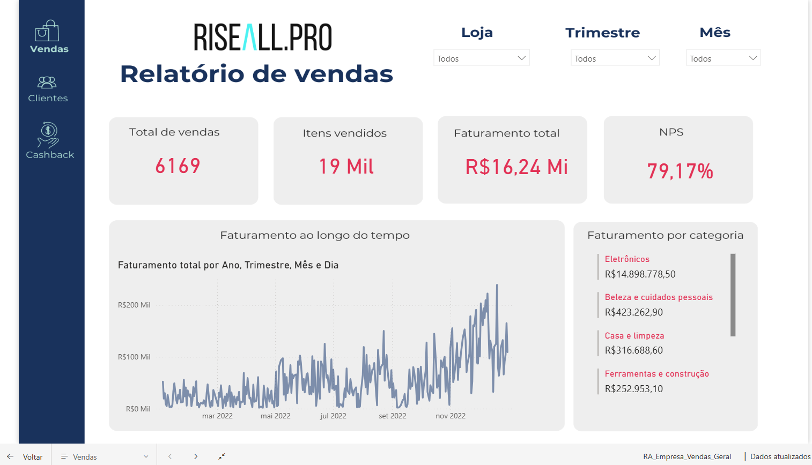
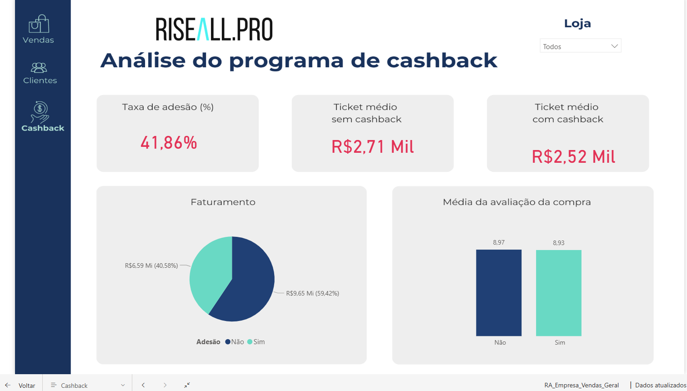

# 📊 Dashboard de Vendas, Clientes e Cashback – RiseAll.Pro

Este projeto apresenta um **painel interativo desenvolvido em Power BI** para análise integrada de **vendas, clientes e programa de cashback**. O objetivo é oferecer uma visão clara e dinâmica sobre o desempenho da empresa, permitindo identificar pontos fortes, oportunidades de melhoria e comportamentos de consumo.

---

## 🚀 Funcionalidades do Dashboard

### 1. **Relatório de Vendas**

* **Total de vendas**: 6.169
* **Itens vendidos**: 19 mil
* **Faturamento total**: R\$ 16,24 milhões
* **NPS**: 79,17%
* **Análises incluídas**:

  * Evolução do faturamento ao longo do tempo (ano, trimestre, mês e dia).
  * Faturamento por categoria de produto (eletrônicos, beleza e cuidados pessoais, casa e limpeza, ferramentas e construção).

### 2. **Análise de Clientes**

* **Clientes únicos**: 4.453
* **Média das avaliações**: 8,95
* **Distribuição por sexo biológico**:

  * Feminino: 45,41%
  * Masculino: 54,59%
* **Outras análises**:

  * Produtos vendidos por categoria.
  * Métodos de pagamento utilizados.

### 3. **Programa de Cashback**

* **Taxa de adesão**: 41,86%
* **Ticket médio**:

  * Sem cashback: R\$ 2,71 mil
  * Com cashback: R\$ 2,52 mil
* **Faturamento com e sem cashback**:

  * Adesão: R\$ 6,59 milhões (40,58%)
  * Não adesão: R\$ 9,65 milhões (59,42%)
* **Média da avaliação de compra**:

  * Sem cashback: 8,97
  * Com cashback: 8,93

---

## 🎯 Objetivos do Projeto

* Consolidar dados de vendas e clientes em um painel único e interativo.
* Facilitar a **tomada de decisão estratégica** com base em indicadores financeiros e de satisfação.
* Avaliar o impacto do programa de cashback no faturamento e na experiência do cliente.

---

## 🛠️ Tecnologias Utilizadas

* **Power BI** – construção do dashboard e visualizações.
* **Banco de Dados corporativo (RA\_Empresa\_Vendas\_Geral)** – origem dos dados.

---

## 📷 Capturas de Tela

### Relatório de Vendas

### Análise de Clientes

### Programa de Cashback

---

## 📌 Conclusão

O dashboard oferece uma visão **integrada e estratégica** dos principais indicadores da empresa, permitindo acompanhar tendências de vendas, perfil de clientes e o desempenho do cashback em tempo real.
